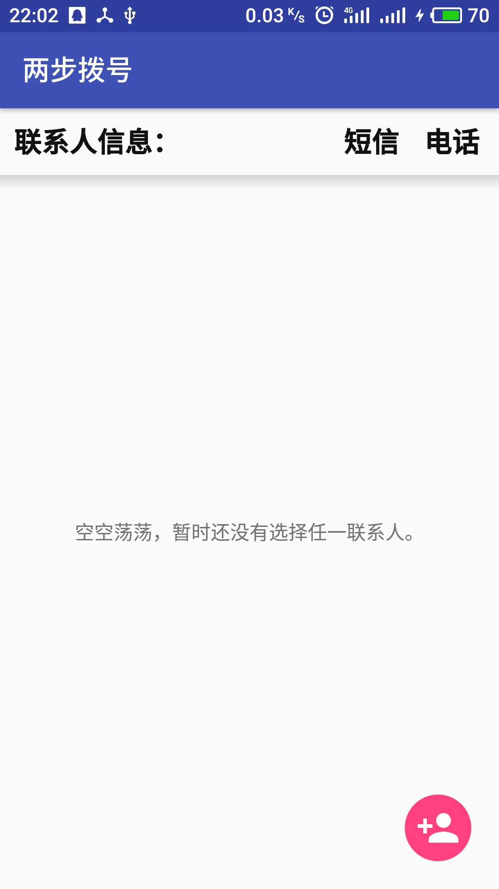
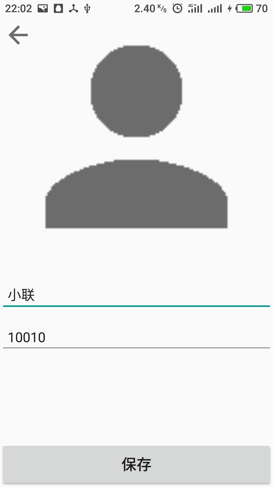
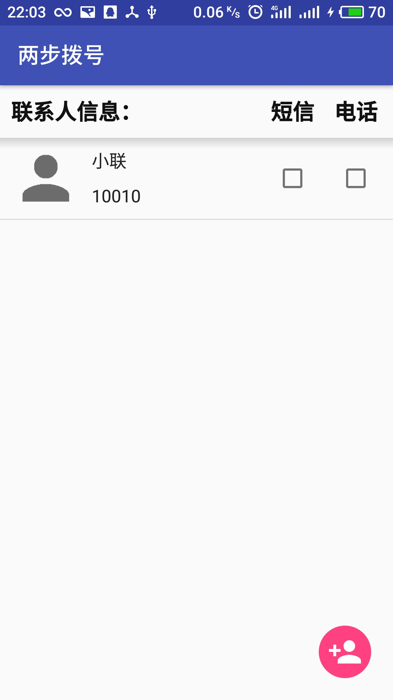
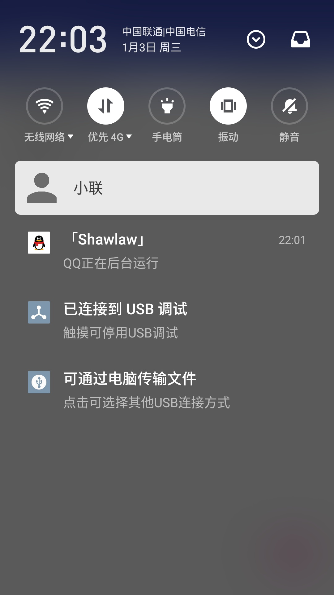
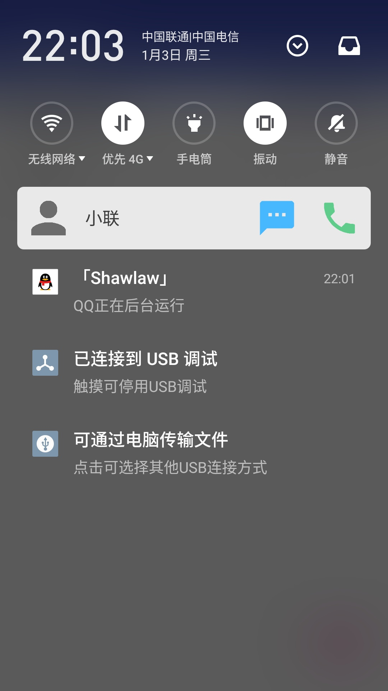

# Description

The application is created for making call/text someone quicker and easier.

Require three permission :

1. android.permission.CALL_PHONE, so that it can directly call the one when you click the notification.
2. android.permission.READ_CONTACTS, so that it can read the phone number of the one you select in contacts.
3. android.permission.RECEIVE_BOOT_COMPLETED, so that it can make sure after your reboot your notification still show up.

All icons are downloaded from [Material Icons](https://material.io/icons/), and I just slightly change the color of some icons.

### Screenshots

#### Empty List

#### Contact Detail

#### Normal List

#### Unchecked Notification

#### Both checked Notification

